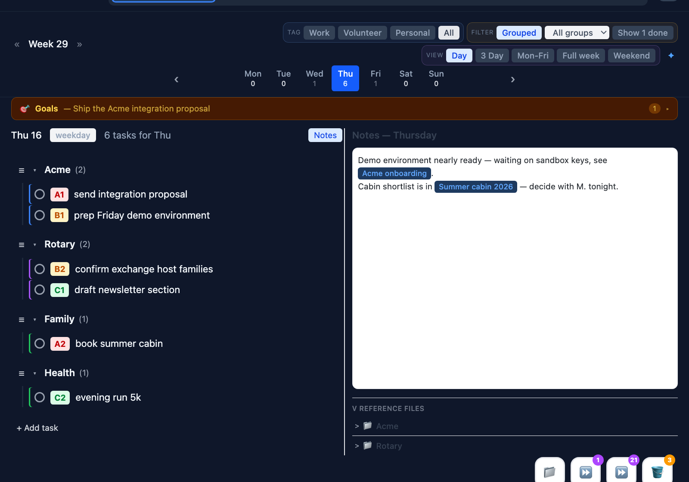
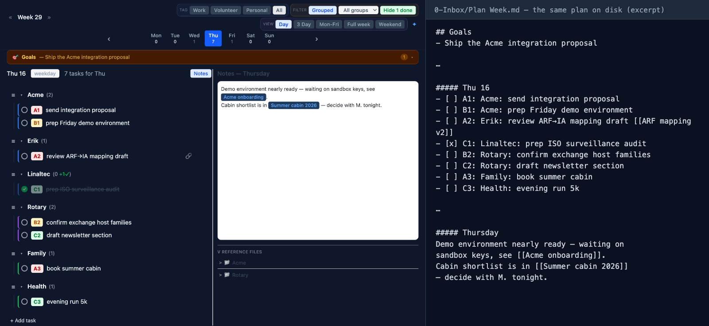

# Nowspace — Personal Coaching Agent


A task planning and coaching tool that reads your [Obsidian](https://obsidian.md/) vault, prioritises tasks using AI, and helps you stay focused through coaching questions.



*One day, three contexts — work, volunteer and personal tasks visibly separated, with the day's notes beside them.*



*Nowspace stores nothing of its own: the plan on the left is the markdown file on the right. The vault is the substrate — anything that can read a file can read your plan, including the AI agents whose output lands here as linked notes for review. Client detail never lives in the plan; the plan holds pointers into separated contexts, one per engagement.*

*(Screenshots show staged demo data.)*

## Table of Contents

- [What It Does](#what-it-does)
- [Download Desktop App](#download-desktop-app)
- [Run with Docker](#run-with-docker)
- [Always-on Mac + Phone Access](#always-on-mac--phone-access)
- [Development Setup](#development-setup)
- [Vault Structure](#vault-structure)
- [Task Icons](#task-icons)
- [Configuration](#configuration)
- [Tech Stack](#tech-stack)
- [Feedback and Issues](#feedback-and-issues)

## What It Does

- **Reads your Obsidian vault** — Parses `Plan Week.md` with daily task lists, groups, and subtasks
- **Prioritises tasks** — Uses Claude AI to assign A/B/C priorities based on your goals and patterns
- **Week planning** — Day view, Mon-Fri, full week, and weekend views with drag-and-drop reordering
- **Bucket list** — Park tasks you want to do later and pull them into any day
- **White elephant breakdown** — Break down hard-to-start tasks into small steps (click the elephant icon)
- **Coaching** — AI-powered coaching questions to help you reflect and stay on track
- **Notes & references** — Scratchpad with wiki-link support and reference file browser
- **Settings** — Configure vault path, API key, and reference groups from the app
- **Saves back to Obsidian** — All changes sync back to your markdown files

## Download Desktop App

Download the latest version for your platform (these links always point at
the newest release — the workflow uploads stable-named copies of every
installer alongside the versioned ones):

| Platform | Download |
|---|---|
| **macOS (Apple Silicon)** | [Nowspace-macos-arm64.dmg](https://github.com/JanLin/nowspace/releases/latest/download/Nowspace-macos-arm64.dmg) |
| **Windows** | [Nowspace-windows-x64-setup.exe](https://github.com/JanLin/nowspace/releases/latest/download/Nowspace-windows-x64-setup.exe) |
| **Linux (AppImage)** | [Nowspace-linux-x86_64.AppImage](https://github.com/JanLin/nowspace/releases/latest/download/Nowspace-linux-x86_64.AppImage) |
| **Linux (deb)** | [Nowspace-linux-amd64.deb](https://github.com/JanLin/nowspace/releases/latest/download/Nowspace-linux-amd64.deb) |

Only the current release is published — older ones are removed when a new one
ships. Instances sharing a vault should run the same release: the vault format
carries a schema version, and an older build refuses to write a newer vault
rather than quietly damaging it.

Or browse all releases: [github.com/JanLin/nowspace/releases](https://github.com/JanLin/nowspace/releases)

> **macOS says the app "is damaged and can't be opened"?** Nothing is
> damaged — the app is not notarized with Apple (no Developer ID
> certificate), and Gatekeeper uses that wording for quarantined unsigned
> apps. After copying Nowspace.app to /Applications, clear the quarantine
> flag once per install/update:
>
> ```bash
> xattr -cr /Applications/Nowspace.app
> ```

### First Launch

1. Open the app — on first launch it will open the **Settings** tab
2. **Set your Obsidian vault path** — browse to your vault folder (the app auto-detects the PARA structure)
3. **Enter your Claude API key** — get one at [console.anthropic.com](https://console.anthropic.com/) (keys start with `sk-ant-`)
4. Once configured, the app switches to the **Plan** tab and loads your week

Your API key is stored locally in `~/.nowspace/.env` and is never sent anywhere except the Anthropic API.

## Run with Docker

Run Nowspace as a web app using Docker, without installing Python or Node.js.

### Prerequisites

- [Docker](https://docs.docker.com/get-docker/) and Docker Compose
- An Obsidian vault with PARA folder structure
- A [Claude API key](https://console.anthropic.com/) (optional — planning works without it)

### Quick Start

1. Clone and configure:

   ```bash
   git clone git@github.com:JanLin/nowspace.git
   cd nowspace
   cp .env.example .env
   # Edit .env — set ANTHROPIC_API_KEY and VAULT_PATH
   ```

2. Start the container:

   ```bash
   docker compose up -d
   ```

3. Open **http://localhost:8000** in your browser.

The `VAULT_PATH` environment variable in `.env` is mounted into the container so the app can read and write your Obsidian files. Changes sync back to your vault on disk.

To stop: `docker compose down`

## Hosting Subscriber Demos

Run isolated per-subscriber instances on an always-on machine — each
reachable only through the subscriber's own Tailscale network (they sign
in via a one-time login link; no credentials change hands), seeded with a
starter vault so no configuration is needed, optionally with Obsidian
streamed to their browser on the same vault. See
[deploy/subscribers/README.md](deploy/subscribers/README.md).

## Always-on Mac + Phone Access

Run Nowspace on an always-on Mac (e.g. a Mac mini holding a Syncthing copy
of the vault) and reach it from your phone anywhere via
[Tailscale](https://tailscale.com). The backend serves the built frontend
itself and production builds use same-origin API calls — no CORS, no extra
server. The `deploy/` folder keeps it updated automatically.

Code blocks below contain no `#` comments on purpose — zsh chokes on
pasted comment lines.

### 1. Prerequisites

- macOS user that will run the service, **logged in graphically** (launchd
  user agents need a GUI session — installing over plain SSH fails with
  `Bootstrap failed: 5`). A dedicated user (e.g. `nowspace`) is a nice
  isolation boundary; enable auto-login for it if the Mac reboots
  unattended, because user agents only run while that user is logged in.
- [Homebrew](https://brew.sh), then `brew install node`. Python 3 ships
  with the system/brew either way.
- Tailscale installed and logged in — the **official app**, not the
  Homebrew daemon (the brew `tailscaled` runs in userspace-networking mode:
  CLI works but apps can't reach the tailnet, and MagicDNS names don't
  resolve).

### 2. Repo access (private repo → deploy key)

```sh
ssh-keygen -t ed25519 -f ~/.ssh/nowspace_deploy
cat ~/.ssh/nowspace_deploy.pub
```

Press Enter twice at the passphrase prompts. Add the printed key at the
repo's **Settings → Deploy keys → Add deploy key** (write access
unchecked), then:

```sh
cat >> ~/.ssh/config <<'SSHEOF'
Host github.com-nowspace
  HostName github.com
  IdentityFile ~/.ssh/nowspace_deploy
  IdentitiesOnly yes
SSHEOF
mkdir -p ~/projects && cd ~/projects
git clone git@github.com-nowspace:JanLin/nowspace.git
cd nowspace
```

### 3. Configuration

```sh
cp config.yaml.example config.yaml
mkdir -p ~/Obsidian/Home/0-Inbox ~/Obsidian/Home/1-Projects ~/Obsidian/Home/2-Areas ~/Obsidian/Home/3-Resources ~/Obsidian/Home/4-Archive
```

Edit `config.yaml`:

- `vault_path` / `vault_root`: the vault location for **this** user
  (the mkdir above creates a placeholder; point Syncthing at the same
  path afterwards and the real vault replaces it — no restart needed).
- `server.host: 127.0.0.1` — only the Tailscale proxy may reach it.
- `coach_enabled: false` — hides the Coach tab and removes the Anthropic
  API key requirement; nothing secret needs copying to this machine.
- Copy your `contexts:` / `context_tags:` / `reference_links:` sections
  from your main machine's config if you use them.

### 4. Build and install the services

```sh
python3 -m venv .venv
.venv/bin/pip install -r requirements.txt
cd frontend && npm ci && npx vite build && cd ..
REPO=$(pwd); mkdir -p ~/Library/LaunchAgents
for f in deploy/com.nowspace.server.plist deploy/com.nowspace.update.plist; do
  sed -e "s|__REPO__|$REPO|g" -e "s|__HOME__|$HOME|g" "$f" > ~/Library/LaunchAgents/$(basename "$f")
  launchctl bootstrap gui/$(id -u) ~/Library/LaunchAgents/$(basename "$f")
done
sleep 5
curl http://127.0.0.1:8000/health
curl -s -o /dev/null -w "%{http_code}
" http://127.0.0.1:8000/
```

Expect `{"status":"ok"}` and `200`. Troubleshooting:

- `Bootstrap failed: 5` → you're not in a GUI session for this user, or a
  half-loaded leftover exists: `launchctl bootout gui/$(id -u)/com.nowspace.server`
  (and `.update`), then bootstrap again.
- Health ok but `/` returns `{"detail":"Not Found"}` → the frontend was
  built after the server started; `launchctl kickstart -k gui/$(id -u)/com.nowspace.server`.
- Anything else: `tail -30 ~/Library/Logs/nowspace-server.log` names it
  (a missing `config.yaml` is the classic).

### 5. Expose to the tailnet

```sh
tailscale serve --bg 8000
tailscale serve status
```

First time, Tailscale prints an admin URL to enable Serve — open it,
**untick "Tailscale Funnel"** (Funnel is public-internet exposure; this
setup is tailnet-only, never enable it for Nowspace) and enable HTTPS.
The very first HTTPS request mints a certificate and can take up to a
minute; later requests are instant.

### 6. Phone

Install the Tailscale app, sign in to the same tailnet, toggle on, open
the URL from `tailscale serve status`, and use "Add to Home Screen" — the
PWA manifest makes it launch full-screen like an app.

**Only one VPN can be active on a phone.** iOS and Android allow a single
packet-tunnel provider, so switching on another VPN — WireGuard, or a work
VPN — disconnects Tailscale without announcing it. The tell is two symptoms
that look unrelated: Tailscale reports `out of sync: unable to connect to
the Tailscale coordination server`, and Nowspace never reaches port 8000.
Both are the same eviction — with no coordination server MagicDNS stops
resolving and `tailscale serve` cannot mint its certificate, so the `ts.net`
URL serves nothing. Check this before debugging the backend: if
`curl http://127.0.0.1:8000/health` answers on the mini, the backend is fine
and the fault is in the tunnel.

Watch for VPN profiles set to connect on demand — they reclaim the tunnel by
themselves, which turns this into an intermittent fault rather than an
obvious one. If you want the rest of your home network from the phone too,
advertise it from the mini rather than running a second VPN (substitute your
own LAN subnet):

```sh
tailscale up --advertise-routes=192.168.1.0/24
```

Approve the route under Machines → the mini → Subnet routes in the admin
console, then enable it in the phone's Tailscale settings. One tunnel does
both jobs.

### Updates are automatic

`deploy/update-nowspace.sh` runs hourly via launchd; when `origin/main`
has new commits it pulls, rebuilds the frontend, refreshes the venv, and
restarts the server — **merging a PR is the deploy**. Check the running
version any time in Settings → About (already-open tabs pick a new
version up on their next reload), run the script by hand for an immediate
update, and find logs in `~/Library/Logs/nowspace-{server,update}.log`.

## Development Setup

### Prerequisites

- Python 3.9+, Node.js 18+
- An Obsidian vault with PARA folder structure
- A [Claude API key](https://console.anthropic.com/) (optional — planning works without it)

### Setup

1. Clone and install:

   ```bash
   git clone git@github.com:JanLin/nowspace.git
   cd nowspace
   pip install -r requirements.txt
   cd frontend && npm install && cd ..
   ```

2. Configure:

   ```bash
   cp .env.example .env
   cp config.yaml.example config.yaml
   # Edit .env with your ANTHROPIC_API_KEY
   # Edit config.yaml with your vault path
   ```

3. Run:

   ```bash
   # Backend
   uvicorn backend.main:app --reload --port 8000

   # Frontend (separate terminal)
   cd frontend && npm run dev
   ```

4. Open **http://localhost:5173** in your browser.

### Versioning and compatibility

Instances (desktop apps, PWA, self-hosted server) interoperate as long as
they speak the same **bucket data format** (`BUCKET_SCHEMA_VERSION` in
`backend/models.py`), which is independent of the app version:

- **Patch releases (0.x.y)** never change the data format. Mixed patch
  levels work together; upgrading is optional.
- **Minor releases (0.x)** may bump the format. When they do, every
  instance must upgrade: out-of-date instances show an amber banner and
  refuse bucket edits (the format marker also travels inside the vault's
  synced settings file, so even the self-contained desktop app detects it).

Rule for contributors: bump `BUCKET_SCHEMA_VERSION` only together with a
minor version bump, and never in a patch release.

### Tests

The backend has a pytest suite covering the funnel gates (stage transitions,
WIP limits, migrations) and the handoff conformance check, including the
canary harness that fails the build if any area's content ever crosses into
another area's files. CI runs it on every PR.

```bash
pip install pytest
python -m pytest backend/tests -q
```

Tests run against a throwaway vault (`tmp_path`) — see
`backend/tests/conftest.py` for the `vault`/`client` fixtures new tests
should build on. They never touch a real vault.

### Staging

To test against a separate vault on separate ports (never touching your
daily vault or the deployed instance), point a worktree-local `config.yaml`
at a staging vault and use the `staging-backend` (8100) / `staging-frontend`
(5273) entries in `.claude/launch.json`. The frontend picks up
`VITE_API_URL` to reach a non-default backend port.

### Building the Desktop App

```bash
# Build the Python sidecar binary
./build-backend.sh

# Build the Tauri desktop app
cd frontend && npm run tauri build
```

The built app will be in `frontend/src-tauri/target/release/bundle/`.

## Vault Structure

The app expects an Obsidian vault with PARA folders:

```
YourVault/
  0-Inbox/
    Plan Week README.md   <-- what every file here is (generated)
    Plan Week.md          <-- Your weekly plan
    Plan Week Bucket.md   <-- Parked tasks (bucket list)
    Nowspace Configuration.md   <-- settings shared by every installation
  1-Projects/
  2-Areas/
  3-Resources/
  4-Archive/
    a0-Inbox/             <-- finished weeks
```

`Plan Week README.md` is written into the folder and kept current, so the
files explain themselves in Obsidian without the app running.

**Moving the plan files.** Settings → *Nowspace's files* moves them to any
folder in the vault — `0-Plan`, say — and records it, so every installation
follows. Update all of them first: one still on an older release refuses to
write once the vault is stamped, rather than carrying on in the folder it knows.

The configuration file does **not** move with them. It stays in `5-Meta/Nowspace/`
(or `0-Inbox/`, where older vaults have it), which is what lets the plan files
go anywhere: a file cannot record its own location, so that one stays findable
and records where everything else lives.

The setting behind it is a *vault* setting, not a per-device one — two
installations sharing a vault must agree, and only the vault's own location
differs between them. In `Plan Week Configuration.md`:

```yaml
plan:
  folder: 0-Inbox                     # default; where the Plan Week files live
  archive_folder: 4-Archive/a0-Inbox  # default; where finished weeks go
```

Both are relative to the vault root. Change them and move the files together,
and make sure every installation is on a release that understands the setting
first — an older one keeps writing the folder it knows.

## Task Icons

Each task has icon actions that appear on hover:

### Focus (Trumpet + Pomodoro)

Click the trumpet to mark a task as your current focus. A **Pomodoro timer** prompt appears with 15 or 30 minute options. The timer floats on-screen with grace period and break controls.

### White Elephant (Breakdown)

Click the elephant to break a hard-to-start task into small, actionable subtasks. Each subtask gets its own checkbox.

### Waiting (Hourglass)

Click the hourglass when a task is blocked. Waiting tasks show a `WAIT:` prefix in Obsidian and are deprioritised in coaching.

## Contexts (Work / Volunteer / Personal)

Optionally separate tasks into three contexts so you can mentally switch off work at the end of the day (and keep private errands out of sight during work hours). Enable by mapping group prefixes in `config.yaml`:

```yaml
contexts:
  work: [acme, client-x]
  volunteer: [rotary]
  # everything else counts as personal
```

When configured, **Work / Volunteer / Personal** filter chips appear in the week view and bucket. Chips toggle independently and combine — e.g. select Personal + Volunteer for the full private-time view, or just Work during the day. **All** clears the filter. The active selection filters every list, panel, and counter — nothing from unselected contexts leaks through. When more than one context is visible, tasks carry a colored left edge (blue work / purple volunteer / green personal).

**Markup convention** — trailing `@` tokens on a task line are metadata, hidden from the displayed label:

- `@w` / `@v` / `@p` — force a context for one task (overrides the group mapping)
- `@pin` — surface a personal/volunteer task during Work mode (the 📌 icon toggles it)

**Teach a group inline** — no need to edit config for new groups: type the tag right after the group name once, e.g. `wallet@w: fix access control`. Nowspace assigns the whole `wallet` group to Work, persists it to config, and cleans the tag from the line on save. Works when typed in the app or directly in Obsidian. Re-teaching (`wallet@p: …`) reassigns the group — latest wins.

Pins are deliberately short-lived: completing the task removes `@pin`, and carrying a task to another day or week drops it too — surfacing an errand during work hours is a decision you re-make each day. Tasks added while a mode is active automatically get that mode's token so they don't vanish from the current filter.

## Configuration

Settings are managed from the **Settings** tab in the app:

- **Vault path** — path to your Obsidian vault (auto-detects PARA structure)
- **Claude API key** — stored in `~/.nowspace/.env`, never bundled with the app
- **Reference groups** — map group names to vault folders for the reference file browser

For development, settings live in `config.yaml` (copy from `config.yaml.example`).

## Tech Stack

- **Desktop:** [Tauri v2](https://v2.tauri.app/) (Rust + WebView)
- **Backend:** Python, FastAPI, Claude API (Anthropic SDK), bundled via PyInstaller
- **Frontend:** React, TypeScript, Tailwind CSS, Vite
- **Storage:** Obsidian markdown files (no database)

## Feedback and Issues

Found a bug or have a suggestion? [Open an issue](https://github.com/JanLin/nowspace/issues).
Thinking of contributing code? Read [CONTRIBUTING.md](CONTRIBUTING.md) first —
Nowspace has binding non-goals, and it's better to know them before you build.

## Support

Nowspace is provided as-is under the AGPL, with no warranty and no support
commitment. Issues and pull requests are read when time allows — there is no
undertaking to respond, to fix, or to merge.

Support, hosting and service levels are available under separate commercial
agreement with Linaltec AB.

## Licence

Nowspace is free software under the
[GNU Affero General Public License v3.0](LICENSE). Use it, study it, change it,
share it. If you run a modified version as a network service, the AGPL asks you
to make your source available to its users — so improvements come back to
everyone instead of disappearing into a closed product.

A commercial licence is available for anyone who needs different terms.

## Website

[nowspace.org](https://nowspace.org) is built from `site/` in this repository
and published by the `Website` workflow. `site/philosophy.html` is generated
from `docs/philosophy.md` by `site/build.py` — edit the markdown, never the
HTML.

To preview it locally, from the repository root:

```bash
python3 site/build.py && cd site && python3 -m http.server 4173
```

See [site/README.md](site/README.md) for the layout, the editing rules and
what still needs wiring up.
